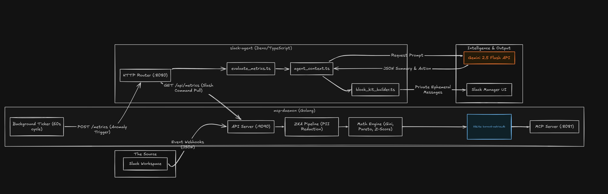

# BurnoutRadar

**Hackathon Track:** Slack Agents for Good &nbsp;|&nbsp; **Author:** Hemanth

BurnoutRadar is a privacy-first, zero-knowledge Slack agent designed to help managers detect early signs of team burnout — without ever reading private messages, tracking individuals, or employing invasive monitoring software.

By analyzing anonymized, aggregate communication metadata, BurnoutRadar identifies systemic risks like **Key Person Dependency**, **Systemic Crunch Time**, and **Silent Isolation**, delivering actionable, LLM-generated insights directly to managers via Slack Block Kit.

---

## The Problem: "Creepyware" vs. Blind Spots

Modern managers face a paradox: they want to protect their teams from burnout, but traditional monitoring tools rely on invasive practices — reading DMs, tracking keystrokes, individual activity scoring. These tools destroy psychological safety. Conversely, relying on periodic quarterly surveys means managers only discover burnout *after* their best engineers have already quit.

---

## The Solution: Zero-Knowledge Architecture (ZKA)

BurnoutRadar solves this by treating communication metadata as a **mathematical distribution problem**. We built a custom Go backend utilizing strict systems programming principles to guarantee employee privacy at the memory level.

### Privacy Guarantees

| Guarantee | Implementation |
|---|---|
| **Ephemeral Cryptographic Hashing** | Raw Slack User IDs are immediately hashed in RAM using HMAC-SHA256 with a `crypto/rand` daily salt. Process termination destroys the salt, achieving perfect forward secrecy. |
| **Stack-Frame Data Destruction** | The ingestion pipeline actively zeroes PII (`msg.Text = ""`, `msg.UserID = ""`) from memory structs *before* they can escape the current stack frame. |
| **Scalar-Only Persistence** | Only high-level mathematical scalars (Gini coefficients, Pareto shares, Z-scores) are ever written to SQLite. No raw events, no user-level data. |
| **No Individual Alerting** | All thresholds are evaluated at the *channel* level — no individual is ever singled out. |

---

## System Architecture

<!-- Architecture diagram placeholder — image will be added shortly -->


### 1. The Go Daemon (`mcp-daemon`)

| Property | Detail |
|---|---|
| **Language** | Go 1.22 |
| **Concurrency** | Two-tier locking (`sync.RWMutex` + per-channel `sync.Mutex`) — processes high-volume webhooks across multiple channels without race conditions |
| **Database** | SQLite — anonymized scalars only, never raw events |
| **MCP Server** | Custom JSON-RPC 2.0 Model Context Protocol server for AI agent queries |
| **Worker** | Background `time.Ticker` evaluates all monitored channels independently; only anomalous channels trigger a downstream POST |

### 2. The Deno Edge Agent (`slack-agent`)

| Property | Detail |
|---|---|
| **Language** | TypeScript / Deno |
| **AI Model** | Google Gemini 2.5 Flash — translates cold mathematical scalars into empathetic, actionable manager summaries |
| **UX** | Slack Block Kit, ephemeral message delivery, 3-second acknowledgement compliance |
| **Slash Command** | `/burnout` — on-demand private report visible only to the invoking manager |

---

## Burnout Detection Models

BurnoutRadar applies three clinically inspired rules to the computed mathematical scalars:

### Key Person Dependency Risk

Triggers when channel volume spikes (Z > 2.0), message distribution is highly unequal (Gini > 0.7), and the top 20% of users produce more than 85% of all traffic.

**Action:** Prompts the manager with a Workload Allocation Review.

### Systemic Crunch Time Risk

Triggers when volume spikes (Z > 2.0), activity is spread across the whole team (Gini < 0.4), but inbound requests heavily outweigh outbound replies (Sent/Received ratio < 0.7).

**Action:** Generates 1-click ephemeral drafts for Comp Time rewards and Anonymous Pulse Surveys.

### Silent Isolation Risk

Triggers when channel volume drops (Z < 1.0), activity shifts heavily to DMs (> 70%), and average message length collapses (> 30% drop from baseline).

**Action:** Generates a 1-click ephemeral draft to declare a team-wide No-Meeting Day.

---

## Statistical Foundation

The Go daemon computes all indicators over anonymous integer slices — no user identity is present at any point in the calculation.

### Gini Coefficient

Measures workload inequality within a channel. A score of 0 is perfect equality; 1 means a single person produces all traffic.

$$
G = \frac{2 \sum_{i=1}^{n} i \, x_i}{n \sum_{i=1}^{n} x_i} - \frac{n+1}{n}
$$

Where $x_i$ are message counts sorted in ascending order and $n$ is the number of active participants.

### Z-Score (Volume Anomaly Detection)

Detects whether the current window's message volume is statistically anomalous relative to a rolling historical baseline.

$$
Z = \frac{X - \mu}{\sigma}
$$

Where $X$ is the current window volume, $\mu$ is the historical mean, and $\sigma$ is the historical standard deviation.

### Pareto Top-20% Share

Measures the fraction of total traffic produced by the top 20% of participants (by message count). Used alongside the Gini coefficient to confirm concentration rather than just inequality.

$$
P_{20} = \frac{\sum_{i=\lceil 0.8n \rceil}^{n} x_i}{\sum_{i=1}^{n} x_i} \times 100
$$

Where counts are sorted in descending order before slicing.

---

## Testing Guide for Judges

The SQLite database has been pre-seeded with representative data so the agent can be evaluated immediately without waiting for a full data collection window.

1. **Join the Workspace** — Accept the Slack invitation provided in the Devpost submission (`testing@devpost.com` & `slackhack@salesforce.com`).
2. **Navigate to the Sandbox** — Open the `#general` channel.
3. **Pull an On-Demand Report** — Type `/burnout` and press Enter. The Deno agent will query the Go daemon, pass the data to Gemini 2.5 Flash, and render a private report visible only to you.
4. **Test Interactivity** — Click the primary action buttons (e.g., **Suggest No-Meeting Day** or **Send Anonymous Pulse Survey**). The bot responds instantly with interactive, ephemeral Block Kit drafts to help resolve the detected issue.

---

## Local Developer Setup

### Prerequisites

- Go 1.22+
- Deno 1.40+
- [Ngrok](https://ngrok.com) (or a similar tunnel)
- A Slack Developer Workspace with a configured app
- A [Google Gemini API Key](https://aistudio.google.com/app/apikey)

### 1. Clone the repo

```bash
git clone git@github.com:guyInTheChair-8bit/burnout-radar.git
cd burnout-radar
```

### 2. Start the Go Daemon

```bash
cd mcp-daemon
go mod tidy

BURNOUT_API_ADDR=":9090" \
BURNOUT_MCP_ADDR=":8081" \
MONITORED_CHANNELS="C123ABC:general,C456DEF:backend-team" \
go run .
```

### 3. Start the Deno Agent

```bash
cd slack-agent

# Copy the env template and fill in your tokens
cp .env.example .env

deno task start
```

### 4. Expose via Ngrok

```bash
ngrok http 8080
```

Update your Slack App configuration with the ngrok domain:

| Slack Feature | Path |
|---|---|
| Event Subscriptions | `/slack/events` |
| Interactivity & Shortcuts | `/slack/actions` |
| Slash Commands (`/burnout`) | `/slack/commands` |

---

## Environment Variables Reference

### Go Daemon (`mcp-daemon/.env`)

| Variable | Default | Description |
|---|---|---|
| `BURNOUT_API_ADDR` | `:9090` | API server listen address |
| `BURNOUT_MCP_ADDR` | `:8081` | MCP JSON-RPC server address |
| `MONITORED_CHANNELS` | — | Comma-separated `CHANNEL_ID:name` pairs |
| `BURNOUT_EVAL_INTERVAL` | `60s` | Background evaluation cadence |
| `BURNOUT_DENO_URL` | `http://localhost:8080` | Deno agent URL for anomaly POSTs |
| `SLACK_BOT_TOKEN` | — | Used for outgoing Authorization headers |

### Deno Agent (`slack-agent/.env`)

| Variable | Required | Description |
|---|---|---|
| `SLACK_BOT_TOKEN` | Yes | Bot OAuth token (`xoxb-...`) |
| `SLACK_SIGNING_SECRET` | Yes | Request signature verification |
| `GEMINI_API_KEY` | Yes | Google Gemini API key |
| `GO_DAEMON_URL` | — | Go daemon base URL (default: `http://localhost:9090`) |
| `BURNOUT_ALERTS_CHANNEL` | — | Default channel for automated alerts |
| `PORT` | — | HTTP listen port (default: `8080`) |

---

## Project Structure

```
burnout-radar/
├── mcp-daemon/                  # Go backend daemon
│   ├── main.go                  # Entry point — wires all services
│   ├── worker.go                # Multi-channel background evaluation ticker
│   ├── analytics/
│   │   ├── hasher.go            # HMAC-SHA256 ephemeral user ID hashing (ZKA)
│   │   ├── pipeline.go          # ZKA ingestion pipeline (PII destroyed in-flight)
│   │   └── stats.go             # Gini coefficient, Pareto Top-20%, Z-score
│   ├── api/
│   │   └── server.go            # HTTP: /webhook/slack, /flush, GET /api/metrics
│   ├── store/
│   │   └── channel_store.go     # Thread-safe multi-channel registry
│   ├── mcp/
│   │   └── mcp_server.go        # JSON-RPC 2.0 MCP server
│   └── db/
│       ├── sqlite.go            # SQLite adapter (scalar writes only)
│       └── schema.sql           # channel_metrics table schema
└── slack-agent/                 # Deno TypeScript frontend
    ├── main.ts                  # HTTP server + all route handlers
    ├── manifest.ts              # Slack app manifest
    ├── deno.json                # Deno config + task definitions
    ├── functions/
    │   ├── evaluate_metrics.ts  # Three-rule burnout threshold evaluation
    │   └── action_handlers.ts   # Block Kit button action handlers
    ├── prompts/
    │   └── agent_context.ts     # Gemini 2.5 Flash API integration
    └── ui/
        └── block_kit_builder.ts # Slack Block Kit dashboard builder
```

---

## License

MIT (c) 2025 Hemanth
